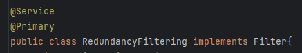
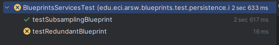

# Escuela Colombiana de Ingeniería

## Arquitecturas de Software

### Integrantes
- **William Camilo Hernández Deaza**
- **Manuel David Robayo Vega**

---

# Componentes y Conectores - Parte I

## Middleware: Gestión de Planos

En este ejercicio se construyó un **modelo de clases** para la capa lógica de una aplicación que permite gestionar planos arquitectónicos de una prestigiosa compañía de diseño.

---

## 1. Configuración con Inyección de Dependencias

Se configuró la aplicación para trabajar bajo un esquema de **inyección de dependencias** utilizando Spring, tal como se muestra en el diagrama.

**Acciones realizadas:**
- Se agregaron las dependencias de Spring en el archivo `pom.xml`.
- Se creó la carpeta `resources` con el archivo `application.properties` para definir el puerto y nombre de la aplicación.
- Se utilizaron las siguientes anotaciones:
	- `@Service` en las clases `BlueprintService` y `InMemoryBlueprintPersistence`.
	- `@Autowired` en el atributo `blueprintPersistence` de la clase `BlueprintService`.

---

## 2. Implementación de operaciones básicas

Se completaron las operaciones:
- `getBluePrint()`
- `getBlueprintsByAuthor()`

Estas fueron implementadas en la clase `BlueprintService` y probadas en `InMemoryPersistenceTest`, confirmando su correcto funcionamiento.

---

## 3. Programa de prueba con Spring

Se creó una clase **Main** que instancia `BlueprintServices` mediante Spring y valida su funcionalidad:
- Registro de planos.
- Consulta de planos.
- Registro de planos específicos.

Al ejecutarse, la aplicación crea varios planos de ejemplo y prueba sus operaciones.

---

## 4. Implementación de filtros

Se implementó un sistema de **filtrado** para procesar los planos antes de retornarlos.

Se diseñó una interfaz `Filter` con dos implementaciones:

1. **RedundancyFiltering**
	- Elimina puntos consecutivos repetidos en el plano.

2. **SubsamplingFiltering**
	- Elimina 1 de cada 2 puntos del plano (submuestreo intercalado).

Ambas clases fueron anotadas con `@Service`.  
La clase marcada como `@Primary` es la que se inyecta automáticamente en `BlueprintService`.

---

## 5. Pruebas de filtros

Se agregaron pruebas unitarias para cada filtro, comprobando que:

- Cuando `RedundancyFiltering` se marca como `@Primary`, los planos se devuelven filtrados por redundancia (A).
- Cuando `SubsamplingFiltering` se marca como `@Primary`, los planos se devuelven por submuestreo (B).

### Resultados de pruebas

**Filtro de redundancia (A):**  
  

**Filtro de submuestreo (B):**  
  

---

Con este esquema, solo cambiando la anotación `@Primary` se puede alternar fácilmente entre los filtros, sin modificar el resto del código.

